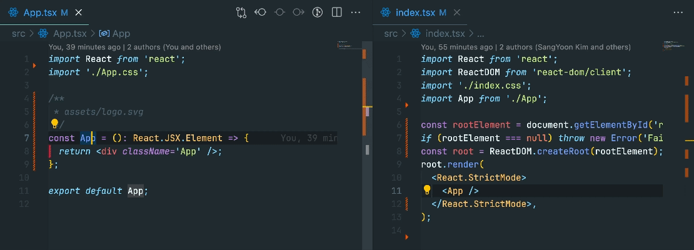

# About JSDoc Comment Image Preview

This is for people who find it bothersome to locate and open image files during development or maintenance.  
VSCode supports Markdown previews in JSDoc comments with the syntax <code>&#33;&#91;image&#93;(image path)</code>, but this feature only works with web URLs or the absolute paths of files.  
Even when using web URLs, this does not work for private repositories, and absolute paths are no longer absolute when collaborating.  
It supports previewing image files( _.jpg, .jpeg, .png, .svg, .gif_ ) by local relative paths in JSDoc comments.

<a href="https://www.buymeacoffee.com/skimo" target="_blank"></a>

## Features

- Provides a preview of a local image when relative file paths are used in JSDoc comments.
- Hovering identifier displays a preivew in a hover popup.
- Focusing an item from the autocompletion list by keyboard displays a preview in a side webview.
- The side webview automatically closes if the autocomplete list cannot be generated.
- Supports multiple lines of image paths.
- Local image paths should not be mixed with any characters except for quotation marks(`'`,`"`) on the same line in JSDoc comments.

  ```typescript
  /**
   * images/example.png                        <- ✅ This is OK
   */
  export const exampleImage: string = "images/example.png";

  /**
   * 'images/example.png'                      <- ✅ This is OK
   */
  export const exampleImage: string = "images/example.png";

  /**
   * Example Image :
   * images/example1.png
   *
   * images/example2.png
   *
   * multiline comments and multiline images   <- ✅ This is OK
   */
  export const exampleImage: string = "images/example.png";

  /**
   * Example Image : images/example.png        <- ❌ Not Working
   */
  export const exampleImage: string = "images/example.png";
  ```

  > 🚨 **URL Path** and **Absolute Path** are also not working.

## Usage Example

### &nbsp;&nbsp;&nbsp;Copy & Paste Relative Path on the Doc comment

- Get relative path of image and include it in the JSDoc(Required)

  
<br />

### &nbsp;&nbsp;&nbsp;Hover Preview

- The preview of image appears in hover popup

  
<br/>

- Multiple lines of images are also possible

  
<br/>

### &nbsp;&nbsp;&nbsp;Completion Preview

- The preview of image appears in the side webview
- The webview closes automatically

  
<br/>

- If there are identifiers with the same name, they are displayed together in the webview

  

<div style="height:48px;"></div>

## Extension Settings

- `jsdocCommentImagePreview.completionPreview`: Enable/disable completion preview.

<div style="height:48px;"></div>

## Known Issues

When a mouse click action occurs outside of the autocomplete list popup while a webview is open, the autocomplete popup may close, but the webview remains open.

<div style="height:48px;"></div>

## Release Notes

Please refer to the [Changelog](CHANGELOG.md) for changes.

<div style="height:48px;"></div>

## Feature Request & Bug Report

Feature requests and bug reports are always welcome. Please open an issue at the [Github repository](https://github.com/skimo-dev/jsdoc-image-preview/issues).
